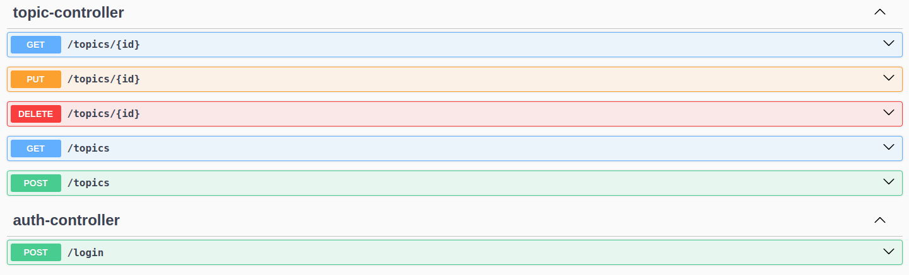

# FORUM HUB API

API desenvolvida para conclusão de challenge da Oracle Next Education.

### Setup

- Crie um arquivo *application.properties* dentro do diretório src/resources e copie o conteúdo do arquivo *application-example.properties*
- Esse projeto utiliza docker para "containerizar" o banco de dados. Utilize o seguinte comando no diretório raiz do projeto para subir o container:

```bash 
docker compose up -d
```

⚠ Necessário ter o docker e docker compose instalados

- Dentro do diretório ***/src*** tem o arquivo ***script.sql*** que pode ser utilizado para "popular" o banco de dados.
- Com todas as etapas concluídas você pode executar o seguinte comando para executar a aplicação:

**Windows**

```bash
gradlew.bat bootRun
```

**Linux/MacOS**

```bash
./gradlew bootRun
```

### Endpoints


